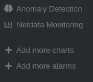
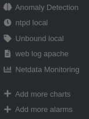

<div align="center">

# Netdata add-on installer and service patch for IPFire <!-- omit from toc -->

Simple Netdata add-on installer and service patch for the IPFire web interface.

</div>

## Current versions <!-- omit from toc -->

* Script: __`0.3.0`__
* Netdata: __[1.47.0-1](https://github.com/siosios/Netdata-on-Ipfire/tree/main/core189)__

## Content <!-- omit from toc -->

* [Features](#features)
* [Installation](#installation)
* [Update](#update)
* [Uninstall](#uninstall)
* [Reset](#reset)
* [Fix broken permissions](#fix-broken-permissions)
* [Service](#service)
* [Known issues](#known-issues)
  * [Netdata plugins does not get started](#netdata-plugins-does-not-get-started)
    * [Workaround](#workaround)
    * [Screenshots](#screenshots)
* [Roadmap](#roadmap)
* [Community](#community)
* [Thanks](#thanks)
* [Author](#author)

---

## Features

The installer script will allow you to do the following:

* Install / Update / Remove / Reset the add-on
* Fix broken permissions
* Backup and restore config files when running `remove` or `reset` commands
* Add / Remove the patch on the __services__ page (__removed__)

## Installation

1. Install `git` with __Pakfire__
2. Clone the project and run the patch:

```console
# pakfire install -y git
# git clone https://github.com/Jiab77/ipfire-netdata-addon-service-patch.git
# cd ipfire-netdata-addon-service-patch
# ./install.sh -h
```

Once done, simply reload the page(s).

> You can remove `git` right after from __Pakfire__ once installed. `git` is just required for downloading and updating the project to get the latest versions.

## Update

```console
# cd ipfire-netdata-addon-service-patch
# ./install.sh -u
```

> You can also use `--update` if you prefer the long version.

## Uninstall

```console
# cd ipfire-netdata-addon-service-patch
# ./install.sh -r
```

> You can also use `--remove` if you prefer the long version.

## Reset

```console
# cd ipfire-netdata-addon-service-patch
# ./install.sh -R
```

> You can also use `--reset` if you prefer the long version.

## Fix broken permissions

This feature should be ran automatically during the install process but if you have used `--no-fix` then you have to do it manually.

```console
# cd ipfire-netdata-addon-service-patch
# ./install.sh -f
```

> You can also use `--fix-perms` if you prefer the long version.

## Service

The Netdata service will be added to the IPFire services page by injecting a custom line inside the `CGI` file.

> __NOTE__
>
> This feature has been removed from the script.

<!--
Here is how it works:

* Install the patch (__don't use it for the moment__)

    ```console
    # cd ipfire-netdata-addon-service-patch
    # ./install.sh -s add
    ```

    > You can also use `--service` if you prefer the long version.

* Remove the patch (__don't use it for the moment__)

    ```console
    # cd ipfire-netdata-addon-service-patch
    # ./install.sh -s rm (or 'remove')
    ```

    > You can also use `--service` if you prefer the long version.

* Test the service

    ```console
    # cd ipfire-netdata-addon-service-patch
    # ./install.sh -s test
    ```

    > You can also use `--service` if you prefer the long version.
-->

## Known issues

Here is the list of known issues and related workarounds.

### Netdata plugins does not get started

When I was looking for the __Unbound__ service graph in Netdata, I've discovered that the `go.d.plugin` was not running and was not displayed when running the `ps fax | grep netdata` command.

It took few hours to debug it but I could finally find the reason why simply no plugin could be started by analyzing the file `/opt/netdata/var/log/netdata/collector.log` and discovered that all plugin got __`permission denied`__ errors:

<p>
<details>
    <summary><strong>Collector logs</strong></summary>

```console
# cat /opt/netdata/var/log/netdata/collector.log.1 | grep -i "permission denied" | sort -u | head -n20
sh: line 1: exec: /opt/netdata/usr/libexec/netdata/plugins.d/charts.d.plugin: cannot execute: Permission denied
sh: line 1: exec: /opt/netdata/usr/libexec/netdata/plugins.d/cups.plugin: cannot execute: Permission denied
sh: line 1: exec: /opt/netdata/usr/libexec/netdata/plugins.d/ebpf.plugin: cannot execute: Permission denied
sh: line 1: exec: /opt/netdata/usr/libexec/netdata/plugins.d/fping.plugin: cannot execute: Permission denied
sh: line 1: exec: /opt/netdata/usr/libexec/netdata/plugins.d/go.d.plugin: cannot execute: Permission denied
sh: line 1: exec: /opt/netdata/usr/libexec/netdata/plugins.d/ioping.plugin: cannot execute: Permission denied
sh: line 1: exec: /opt/netdata/usr/libexec/netdata/plugins.d/perf.plugin: cannot execute: Permission denied
sh: line 1: exec: /opt/netdata/usr/libexec/netdata/plugins.d/python.d.plugin: cannot execute: Permission denied
sh: line 1: /opt/netdata/usr/libexec/netdata/plugins.d/charts.d.plugin: Permission denied
sh: line 1: /opt/netdata/usr/libexec/netdata/plugins.d/cups.plugin: Permission denied
sh: line 1: /opt/netdata/usr/libexec/netdata/plugins.d/ebpf.plugin: Permission denied
sh: line 1: /opt/netdata/usr/libexec/netdata/plugins.d/fping.plugin: Permission denied
sh: line 1: /opt/netdata/usr/libexec/netdata/plugins.d/go.d.plugin: Permission denied
sh: line 1: /opt/netdata/usr/libexec/netdata/plugins.d/ioping.plugin: Permission denied
sh: line 1: /opt/netdata/usr/libexec/netdata/plugins.d/perf.plugin: Permission denied
sh: line 1: /opt/netdata/usr/libexec/netdata/plugins.d/python.d.plugin: Permission denied
```

</details>
</p>

I then looked at the `/opt/netdata/usr/libexec/netdata/plugins.d` folder and seen that all the `*.plugin` files had their `GID` defined to the group id `999`.

The problem here is that the group id `999` does not exist on __IPFire__...

You can check it on your side by running these commands:

* Search for the group id `999`

    ```console
    # grep -c "999" /etc/group
    0
    ```

* Search for the user id `999`

    ```console
    # grep -c "999" /etc/passwd
    0
    ```

While if you are running the same commands but with `netdata` instead:

* Search for the group name `netdata`

    ```console
    # grep -c "netdata" /etc/group
    1
    ```

* Search for the user name `netdata`

    ```console
    # grep -c "netdata" /etc/passwd
    1
    ```

#### Workaround

So... What does all of this means? Well... it means that there is probably a permission issue during the install process or during the package building process.

To be sure of that and also find a way to fix that permission issue, we'll need to find which files are impacted and set to the wrong group id.

Here is how to do so:

```console
# find /opt/netdata -group 999 2>/dev/null | wc -l
321
```

> Woow... that's quite a lot 😅 Just forget to fix them all manually 😆

Ok so let's stop the Netdata service, fix the permissions, restart the service and see how it goes after that!

```console
# /etc/init.d/netdata stop
Stopping real-time performance and health monitoring...                                          [  OK  ]

# find /opt/netdata -group 999 | wc -l
321

# find /opt/netdata -group 999 -exec chown -c root:netdata {} \; | wc -l
321

# find /opt/netdata -group 999 | wc -l
0

# /etc/init.d/netdata start
Starting real-time performance and health monitoring...

# /etc/init.d/netdata status
netdata is running with Process ID(s) 20865 20863 20859.
```

Now, if you check the screenshots in the next section, you should get a similar result on your side.

Don't worry, you'll not have to do all this technical things, I've already implemented everything in the [install.sh](install.sh) script 😉

If you want to fix your current installation, you just need to run the following command:

```console
# cd ~/ipfire-netdata-addon-service-patch
# ./install.sh -f
```

> You can also use `--fix-perms` instead if you prefer long arguments.

Or if you want to be more radical and reset your Netdata installation, you can run this command instead:

```console
# cd ~/ipfire-netdata-addon-service-patch
# ./install.sh -R
```

> You can also use `--reset` instead if you prefer long arguments.

If for whatever reasons you want to reset your Netdata installation __without__ fixing the permissions, you can run this command:

```console
# cd ~/ipfire-netdata-addon-service-patch
# ./install.sh -R --no-fix
```

That's all! Hope that all of this could have been helpful for everyone. 🙇‍♂️

#### Screenshots

* __Before fixing permissions__

    
  
* __After fixing permissions__
  
    

## Roadmap

* [X] Create initial version
* [X] Make the script better
* [X] Fix permissions issues
* [X] Implement __script__ `update` feature
* [ ] Finish the `service` code
* [ ] See if the [kickstart](https://learn.netdata.cloud/docs/installing/one-line-installer-for-all-linux-systems) method can be supported

## Community

You can find the discussion around this project [here](https://community.ipfire.org/t/netdata-addon-by-ummeegge/5318).

## Thanks

Huge thanks to [@siosios](https://github.com/siosios) for his work on the [Netdata package](https://github.com/siosios/Netdata-on-Ipfire) for [IPFire](https://www.ipfire.org/)!

## Author

* [Jiab77](https://community.ipfire.org/u/jiab77)